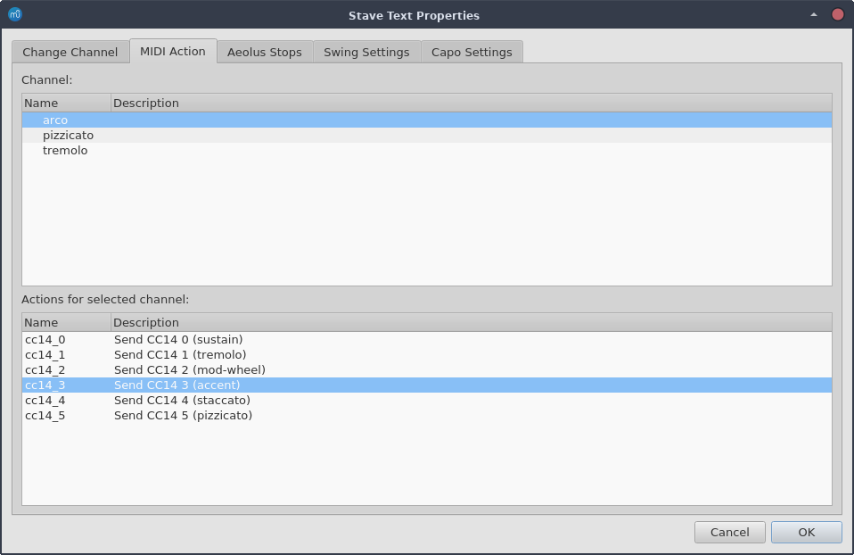

MuseScore MIDI actions for Virtual Playing Orchestra
====================================================

This is an attempt to facilitate the usage of [Virtual Playing Orchestra (VPO)](http://virtualplaying.com/virtual-playing-orchestra/) when scoring with [MuseScore](https://github.com/musescore/MuseScore), whether the playout is done via MuseScore itself (Zerberus). It is not complete yet, and must be considered very much "Work In Progress", since I'm actually playing with all these things for the first time myself, in order to try and get my life easier with my scores.

Specifically, this repo tries to do the following:

1. Add MIDI actions that can issue a specific set of MIDI CC (Continuous Controller) to a MuseScore score programmatically, since there's apparently [no UI to do that in MuseScore itself](https://musescore.org/en/node/301586);
2. Add new [Sforzando (SFZ)](https://sfzformat.com/) files that use VPO and react to the CC above as some sort of keyswitch;
3. Provide an Ardour orchestra template (based on the amazing work done by [Michael Willis](https://github.com/michaelwillis/virtual-playing-orchestra-ardour-template/)) that is pre-configured with those SFZ (not available yet).

Before I go into the details, a few words on the motivation for that: in case there actually are easier ways of doing the same thing I'm not aware, please don't hesitate to just open an issue and make a fool of me for wasting my time! If you don't really care about that, but only want to know what is in this repo and how to use it, [jump to the next section](#content).

# Rationale

I've only recently started working on some orchestal scores to work on classical music (part of my [New Year's Resolution!](https://twitter.com/elminiero/status/1213054169277509633)) using MuseScore, and I'm loving every minute of it. It has presented a few challenges, though, in particular when it has come to render the written note to something pleasant to the ear: the default soundfont provided by MuseScore is very nice for previews, but is not the best way to present an orchestral work.

The above mentioned VPO is probably the best option there is in the free and open source ecosystem, as it is based on many samples coming different libraries, basically trying to provide the best of all those free options. I've used this myself in [many tracks](https://soundcloud.com/lminiero) already, and I really like how it sounds. The way it works is by providing different SFZ files for different instruments in the orchestra: more importantly, for each each instrument a set of different SFZ options are provided, depending on what is needed. A pizzicato violin uses completely different samples from a sustained violin, for instance, and so does a solo violin compared to a string section. Additional options are provided to react differently to some MIDI input.

This is where things start to get complicated when it comes to orchestral scoring. When working on a score, these different ways of presenting the sound of an instrument typically comes with articulations: e.g., the same violin staff can start with an accent, then become more sustained, then go with a few staccato notes, and end up with a pizzicato arpeggio. All this, in MuseScore, happens in the same staff, and so the same track, due to how MuseScore mixes and plays the score. This is very different from now a DAW like, e.g., [Ardour](https://ardour.org/) (a popular choice for working on a score to render it) works instead, as in that case, in fact, different "sounds" for the same intrument (e.g., sustained vs. pizzicato vs. tremolo strings) are typically put on different tracks hosting the different SFZ soundfonts. This can lead to some very tedious post-processing, because in order to get Ardour to correctly play your score, you'd need to:

1. Export the MuseScore score to a MIDI file (or individual MIDI files for each staff/part);
2. Import the MIDI file(s) in Ardour as separate tracks;
3. For all the articulations that require a different SFZ, "cut" the notes from the track for the main instrument, and "paste" it on the track with the related articulation;
4. Fix and mix many more tracks that there are staves in the score.

Whether more tracks will require more horsepower from your CPU or not, point 3. can be quite problematic on its own, especially when working with large (and long) orchestral scores. Besides, it would make corrections even harder, because any time you fix something in the original MuseScore score (e.g., because you found out a passage works better when done a different way), you have to repeat the splitting of the articulations for all the affected parts all over again.

Luckily, SFZ files can be quite flexible, and VPO comes with a few options that do indeed take advantage of that functionality. Specifically, out of the box VPO provides some "keyswitched patches" (KS): quoting from the documentation:

> Rather than needing to load each of the above into a separate instance of a .sfz player, load a KS patch instead and use a special MIDI note to change which articulation will be used.

The way this works is that a KS SFZ file is configured to react to some MIDI notes outside of the range of the target instrument (e.g., `C2-F2` for a violin, which are below the lowest note a violin can play): when such a note is played, a different set of samples can be "activated". This way, if you associate, e.g., `C2` to sustain and `E2` to staccato, any time you hit `E2`, all the notes that follow will use the staccato samples, and will change back to the sustain samples as soon as you send `E2` instead. This works by basically configuring this custom KS SFZ files as some sort of combination of the individual SFZ articulation files, that can be triggered using these set of keys (hence the "keyswitch" name).

This works quite well, and is a very nice feature when playing live, but is hard to use with MuseScore. In fact, in order to script an articulation change, we need to send a MIDI note, which in MuseScore is done adding the actual note to the score. Even hiding it somehow, there are very good chances that this ends messing the actual score somehow. A better option would be using custom MIDI CC messages for the task, as they can be added to a MuseScore text in the form of "stave text", which is quite easy and harmless to hide instead. That said, there are a few problems with this:

1. MuseScore doesn't allow sending a MIDI CC easily. While the feature is there, it requires a [manual manipulation of the `instruments.xml` file](https://musescore.org/en/node/270961), to basically add a pre-configured set of `MidiAction` items to send a specific CC number and value; only after that they appear in the UI.
2. VPO doesn't provide ways to react to custom CC messages to do something like the KS patches to.

This is exactly why I started investigating all of the above, in order to figure out if I could add work around the issues described above, which brings me to the next section.

# Content

This repository, at the time of writing, contains basically two things:

1. A set of SFZ files you can use with VPO, in order to react to CC 14 to switch articulations;
2. A simple node.js script to add MIDI actions to an existing MuseScore score, so that you can send CC 14 values from there.

If you're wondering why I chose CC 14 and not another controller, that's simply because 14 is apparently unassigned at the moment, and so looked like a good option as any other. You're of course free to change the CC to use, and the related mappings, which are entirely arbitrary.

## Virtual Playing Orchestra CC14 SFZ

The `VPO` folder contains a set of patches to react to CC 14 messages for changing articulations. They're basically an edited version of the pre-existing `-KS` patches, configured to react to CC14 instead using the [`loccN` and `hiccN` opcodes](https://sfzformat.com/opcodes/loccN). Since I only needed a subset of the available instruments (to go with the Symphonic Orchestra template in MuseScore), you won't find them all here, but just some, specifically:

* Woodwinds: solo flute, oboe, clarinet and bassoon;
* Brass: solo french horn, trumpet, trombone and tuba;
* Strings: section for 1st violins, 2nd violins, violas, celli and contrabasses.

If you need more instruments, please refer to the changes I made to obtain the existing ones to see how you can patch a `-KS` file.

Installing them should be very easy, as all you need to do is copy (or create a symbolic link for) all the `.sfz` file in the VPO subfolders to the corresponding folder where you installed VPO itself. To avoid conflicts and keep the distinction between original and new files clearer, all the SFZ files from this repo are prefixed with `0LM-`, and use the `-KS-CC14` suffix to clarify what is used as a switch.

For what concerns the mappings, I kept pretty much the same order as the original `-KS-C2`, `-KS-C5` and `-KS-C6` files, which should make your life easier if you were already using those. Specifically:

| Articulation | -KS-C2 | -KS-C5 | -KS-C6 | -KS-CC14 |
|:------------:|:------:|:------:|:------:|:--------:|
| Sustain | C2 | C5 | C6 | 0 |
| Tremolo | C#2 | C#5 | C#6 | 1 |
| Normal Mod Wheel | D2 | D5 | D6 | 2 |
| Accent | D#2 | D#5 | D#6 | 3 |
| Staccato | E2 | E5 | E6 | 4 |
| Pizzicato | F2 | F5 | F6 | 5 |

Obviously, not all instruments support all articulations: specifically, only strings support them all, while woodwinds and brass instruments won't react to `Tremolo` and `Pizzicato`.

To see this working after you've installed the files to the right place, load one of the existing SFZ files, e.g., with the excellent [sfizz](https://github.com/sfztools/sfizz):

	sfizz_jack -client_name 0LM-1st-violin-SEC-KS-CC14.sfz

hook it up to a real or virtual keyboard, and then use some tool to send CC messages, e.g., with [SendMIDI](https://github.com/gbevin/SendMIDI):

	a2jmidi_bridge
	# Connect Jack side of the bridge to sfizz
	sendmidi dev "playback" cc 14 4
	# Playing the strings should now be staccato

Sending the different CC 14 values should result in the samples being used to change.

## MuseScore tool to add MIDI actions

As anticipated, while MIDI actions are definitely supported in MuseScore, there is no easy way to just inject one in the score. The documented way to get this done is by messing with the `instruments.xml` file MuseScore ships, which is where all instruments available in the UI are defined. If you add some `<MidiAction>` elements to an instrument in the XML, they'll become available in the UI as well. Unfortunately, while MuseScore allows you to contribute a secondary XML file for instruments, [it does NOT allow for just _extending_ existing instruments](https://musescore.org/en/node/301773), so the only way to do this properly is make a copy of the XML file, make the changes, and tell MuseScore to use that one for instruments in the preferences. While this probably "works", it's an approach I don't like, as it basically "forks" the instruments file for all the new sessions; should a MuseScore update come out with fixes and/or improvements on that file, the fork would be stuck to the old version.

That said, I found out that the same kind of changes can be done on existing scores as well. In fact, a MuseScore `.mscz` file is simple a ZIP file that contains a `.mscx` file (the score and related info), plus some metadata and thumbnail(s). The `.mscx` file itself is an XML file, and also contains a lot of info that matches the stock instruments file: this makes sense, since when you create a new MuseScore session, whether you use a template or do it manually you end up choosing a set of instruments, which are indeed derived from the master file.

As such, I wrote a simple aplication in node.js to add MIDI actions for the VPO scripts I introduced above. The way it works is:

1. It extracts the `.mscx` file from the `.mscz`, and imports the XML content to work on it;
2. It looks for the instruments section, and adds a set of `<MidiAction>` voices from a configuration file on some instruments;
3. It regenerates the XML file, and replaces the `.mscx` file in the `.mscz`.

The end result is a file you can open in MuseScore, which for the supported instruments will have MIDI actions you can add via stave text. Please notice that this is very much experimental, and so you definitely want to make backups of every file you may choose to pass to this tool. I won't take any responsibility if this messes something up (like that brilliant score you've been working on for the past 15 years!).

Installing is trivial (assuming you have node.js on your system), since you just need to issue an:

	npm install

The script then comes with a few command line arguments:

	[lminiero@lminiero musescore-instruments-actions] $ node add-actions.js
	MuseScore MidiAction to instruments.xml v0.0.1
	----------------------------------------------
	add-actions.js [-h|--help] [-v|--version] [-c|--config custom-config.js] -i input.mscz [-o output.mscz]

The source `.mscz` must be provided via `-i`; by default the script will update the contents of the same file, but you can specify a different target `.mscz` using `-o` (especially useful if you don't want to overwrite the source file and cause a mess), e.g.:

	node add-actions -i /home/lminiero/Scores/test.mscz -o testCC14.mscz

The most important part is the configuration file, though, as it configures the behaviour, namely as which MIDI actions to add an for which instrument. The repo comes with a `config.js` file that is used by default if you don't provide a different configuration via `-c`: this file adds MIDI actions to send CC 14 values, providing labels to make their purpose clearer (e.g., sustain=0). It should be easy enough to figure out how to use different CC numbers and values for your needs, in case you don't want to make the same choices I did in this repo. If you've worked on your own configuration file, as anticipated you can tell the tool to use it via the `-c` flag:

	node add-actions -c myconfig.js -i /home/lminiero/Scores/test.mscz -o testCC14.mscz

> Note: the configuration file is also where you configure the path to use for temporary files. The one in the repo is hardcoded to `/tmp`, which definitely works on Linux, but you may want to change that if you're using a different OS.

To check if this worked, open the new score using MuseScore, add a stave text somewhere, right-click it to edit the stave text properties, and MIDI actions should become available in the related tab:

That said, check the [Issues](#issues) section below for some workarounds that are currently needed.

## Ardour template

TODO. (but as anticipated will be based on the excellent https://github.com/michaelwillis/virtual-playing-orchestra-ardour-template/)

# Issues

While this "kinda" works already, it has several issues, that I'm addressing as I go along. Here's a short list of the main things I noticed so far (even though there may be more I'm not aware of yet).

* When importing MIDI generated using the CC14 messages in Ardour, you'll need to change the controller mode from `Linear` to `Discrete`, otherwise a transition from, e.g., `5` (pizzicato) to `2` (normal) will go through `4` and `3` as well, which is NOT what you want. An easy way to do that is to show the Automation for Controller 14, and right-click it to change the mode. In the future, when I'll work on an Ardour template, I'll make sure this is done already for the pre-existing tracks.

* While MuseScore adds the MIDI CC 14 messages just fine, it looks like they're sent _after_ the note they're tied to (not sure if always, or just some times), which of course makes it all wrong when you're trying to play it. A partial workaround is to put the stave text with the MIDI action on the note/rest _before_ the one you want to affect (assuming this behaviour is consistent, that is).

* When a tremolo is added to a note in MuseScore, this is played and rendered in the MIDI file as a sequence of very short notes. This is not what you want when the tremolo articulation of VPO is used instead, which is actually a collection of samples where the note is already repeated. A partial (and ugly) workaround, at the moment, is to remove all the tremolo markings from the score _before_ exporting to MIDI (so that they actually are a single, longer, note), and keep the markings in MuseScore itself instead (e.g., to make it look right when exporting to PDF). This is also needed because of the previous issue, if you need an articulation change at the end of the tremolo (most tiny notes of the last tremolo would have the following articulation instead).
